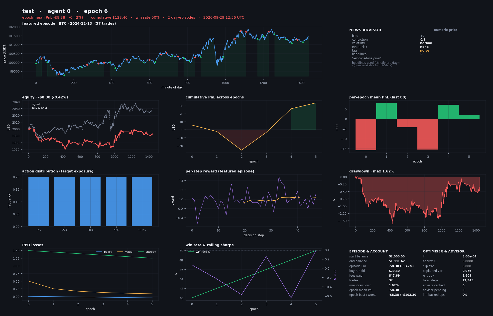

# trader_v4

Offline, multi-GPU **PPO reinforcement-learning crypto trader** for BTC / ETH / LTC,
with a CPU-side **int4-quantised Mistral-7B** that reads each day's news and hands
the RL agents a structured signal.

Everything the trainer needs — minute bars, daily market context, news headlines,
and the 7B model weights — is **committed in this repository**. The training host
never downloads anything and outbound sockets are blocked by default.

```bash
python tools/verify_setup.py     # check the host, offline
python train.py --epochs 2000    # one agent per GPU, resumable
```

---

## 1. What's in here

| Path | What | Size |
|---|---|---|
| `data/minute/<SYM>/<YEAR>.parquet` | 1-minute OHLCV, BTC/ETH/LTC, **Aug 2017 → Sep 2026** | ~330 MB |
| `data/daily/market_daily.parquet` | 26 daily market-moving features | 0.2 MB |
| `data/news/headlines/<YEAR>.jsonl.gz` | per-(day, coin) headlines | ~3 MB |
| `models/mistral7b-int4/` | Mistral-7B-Instruct-v0.3 in int4, 53 shards | ~4.0 GB |
| `src/`, `train.py` | the trainer | ~150 KB |
| `scripts/` | the downloaders that built `data/` (for reproducibility) | — |

**~9,800 tradable day-episodes** (BTC 3,306 · ETH 3,306 · LTC 3,190).

### Daily features (`market_daily.parquet`)

| Group | Columns |
|---|---|
| Sentiment | `fear_greed` |
| BTC on-chain | `btc_n_transactions`, `btc_hash_rate`, `btc_difficulty`, `btc_miners_revenue`, `btc_n_unique_addresses`, `btc_mempool_size`, `btc_avg_block_size`, `btc_estimated_transaction_volume_usd`, `btc_market_price` |
| Derivatives | `btc_funding_rate`, `eth_funding_rate`, `ltc_funding_rate` (OKX perps) |
| Attention | `wiki_views_bitcoin`, `wiki_views_ethereum`, `wiki_views_litecoin`, `wiki_views_cryptocurrency` |
| Macro | `usd_broad_index`, `fed_funds_rate`, `treasury_10y`, `yield_curve_2s10s`, `vix`, `sp500`, `hy_credit_spread`, `wti_oil`, `nasdaq100` |

---

## 2. How training works

**One episode = one UTC day, one randomly chosen coin, a fresh $2,000 of fake cash.**

- The agent picks a **target exposure** (0 %, 25 %, 50 %, 75 %, 100 % of equity in
  the coin) rather than raw buy/sell, so the action space is identical whether the
  day is a $100k BTC day or a $60 LTC day.
- It decides every `--decision-interval` minutes (default 5 → 288 decisions/day),
  but equity is marked to market every single minute.
- Rebalancing costs **10 bps fee + 2 bps slippage** on traded notional. This is not
  cosmetic: a random agent churns ~230 times a day and burns **$257 of a $2,000
  account** in fees. Not churning is something the agent has to learn.
- At the close the position is liquidated so PnL is realised and comparable.
- Reward = Δ log-equity × 100 − drawdown penalty − turnover penalty. Log-equity
  keeps the reward scale-free across coins.

**One epoch = `--episodes-per-epoch` day-episodes (default 8) + one PPO update.**
Set `--episodes-per-epoch 1` for literally one trading day per epoch.

### Observation (200 floats)

| Slice | Dims | Contents |
|---|---|---|
| price features | 153 | 17 causal indicators at 9 lags (0,1,2,4,8,16,32,64,128 bars) |
| account | 8 | exposure, unrealised PnL, time in position, cash %, equity, drawdown, trade count, time left |
| time | 2 | cyclical minute-of-day |
| daily context | 26 | the table above, robust-normalised, from **D-1** |
| **advisor** | **8** | bias, conviction, volatility, event risk, source, headline count, tone, topic |
| coin | 3 | one-hot |

---

## 3. The news advisor

A quantised Mistral-7B runs **on CPU, in its own process**, in parallel with the
GPU trainers. For a given (coin, day) it reads the previous 48 hours of headlines
plus the market state as of D-1 close and emits **exactly one JSON object**:

```json
{"bias": 1, "conviction": 2, "volatility": "high", "event_risk": "some",
 "tag": "etf_flows", "why": "spot ETF inflows accelerating"}
```

Three things make this actually work rather than just sound good:

**Strict output shape.** The prompt states the schema, forbids prose, and the
decoder is *primed* with `{"bias":` so the first generated token is already inside
the JSON. `parse_response()` validates every field and range and **rejects**
anything malformed instead of best-effort parsing it. Unknown enum values are
coerced to safe defaults.

**Strict timeline.** For an episode on day D the advisor may only see information
stamped before D 00:00 UTC. `select_headlines()` *asserts* this and raises if a
later-dated headline slips through — a loud crash is better than silent look-ahead
that inflates backtest PnL. The daily context row is taken from D-1.

**It never blocks training.** Verdicts live in a SQLite (WAL) cache shared by every
process. On a cache miss the env instantly uses `numeric_prior()` — a deterministic
crypto-lexicon + fear&greed + realised-vol signal **in the same 8-float shape** —
and queues that day for the daemon. The observation geometry never changes, so a
run resumed months later still matches its checkpoint.

Each (coin, day) is answered **once, ever**. Pre-fill the cache with:

```bash
python precompute_advisor.py --threads 8 --batch-size 8
```

> Batch size is the biggest throughput lever. In int4 mode the weight-unpack cost is
> paid **per forward call, not per sequence**, so 8 prompts cost about what 1 costs.

---

## 4. Multi-GPU

`train.py` detects `torch.cuda.device_count()` and launches **one independent PPO
agent per GPU**, each with its own checkpoint, metrics and PNG stream.

Agents don't run identical configs — that would only reduce variance. `--vary-hparams`
(on by default) spreads learning rate, entropy bonus, discount and drawdown penalty
across agents, turning extra GPUs into a small **population search**:

| agent | lr × | ent_coef | gamma | dd_penalty |
|---|---|---|---|---|
| 0 | 1.0 | 0.01 | 0.997 | 0.5 |
| 1 | 0.5 | 0.02 | 0.999 | 0.2 |
| 2 | 2.0 | 0.005 | 0.99 | 1.0 |
| 3 | 0.33 | 0.03 | 0.995 | 0.35 |

Force a count with `--agents N` (works on 1 GPU or CPU-only too).

---

## 5. Output: one PNG per epoch per agent

`runs/<run>/agent<k>/png/epoch_000123.png` — a 12-panel dashboard:

price + entry/exit markers · advisor verdict and the headlines it read · equity vs
buy-and-hold · cumulative PnL · per-epoch PnL · action distribution · per-step
reward · drawdown · PPO losses · win rate & Sharpe · full account and optimiser
stats.



`--png-keep-last 400` prunes old images but always keeps every 50th as a milestone trail.

---

## 6. Resuming

Resume is the default. Just run the same command again.

Every epoch writes an atomic checkpoint (tmp + `os.replace`, so `kill -9` can never
truncate it) with two rotating slots plus a `ckpt_best.pt`. Saved state includes the
policy, optimiser, **observation normaliser**, epoch counter and the python/numpy/
torch/env RNG states — so a resumed run continues the same stochastic trajectory
instead of silently re-rolling the same days. Metrics append to `metrics.jsonl`,
which survives even if a `.pt` write is interrupted.

```bash
python train.py --epochs 5000          # picks up where it stopped
python train.py --no-resume            # start over
```

---

## 7. Running on Snowflake

The image already has torch 2.13, transformers 5.17, safetensors, pandas, pyarrow
and matplotlib. Nothing else is needed — **no pip install**.

```bash
python tools/verify_setup.py
python train.py --epochs 2000
```

Useful flags:

```bash
python train.py --no-llm                       # skip the advisor entirely
python train.py --agents 4 --episodes-per-epoch 16
python train.py --decision-interval 15         # 96 decisions/day, faster epochs
python train.py --allow-short                  # 9 actions, -100% .. +100%
python train.py --llm-materialize --llm-dtype bfloat16   # ~14GB RAM, much faster LLM
```

**Repo size.** ~4.4 GB, so a clone plus working tree is ~8–9 GB on disk. Every blob is
under GitHub's 100 MB hard limit. If the trial workspace is tight, a sparse checkout
that skips `models/` still gives you a fully working trainer on the numeric prior.

---

## 8. Design decisions worth knowing

**Why a hand-written int4 format instead of GGUF / bitsandbytes / AWQ / GPTQ?**
The target host has `torch` + `transformers` + `safetensors` and **cannot install
anything**. Every off-the-shelf 4-bit format needs an extra runtime
(llama.cpp, bitsandbytes, autoawq, gptqmodel, the `gguf` package). So the repo ships
its own format and a ~120-line pure-torch kernel (`src/llm/int4_linear.py`).

**Why not `transformers.MistralForCausalLM`?** The host pins transformers 5.x, whose
internals differ from the 4.x layout these weights were exported under, and there is
no network access to fix a breakage. `src/llm/mistral_int4.py` implements the decoder
directly (~250 lines). `transformers` is used only for `AutoTokenizer`.

**Quantisation quality.** Asymmetric 4-bit, group size 128, with an **MSE-optimal clip
search** per group. Plain round-to-nearest lets one outlier per group stretch the
16-level grid; searching 10 clip ratios and keeping the best recovers real accuracy
for zero extra bytes and zero inference cost. Verified against the original bf16
weights fetched by HTTP range request:

| tensor | plain RTN | with clip search |
|---|---|---|
| `layers.0.self_attn.q_proj` | 0.1566 | **0.1369** |
| `layers.0.mlp.gate_proj` | 0.1046 | **0.0989** |

**Why a custom env instead of Gymnasium?** `gymnasium` isn't in the host image.
The env is a plain class with `reset`/`step`; `VecTradingEnv` steps N episodes in
lockstep **in one process**, because the parquet and news stores are already resident
and subprocess workers would duplicate ~400 MB each.

**Chronological validation split.** `--train-frac 0.85` holds out the most recent
~15 % of days. The tail is never trained on, and `--eval-every` runs a greedy rollout
on it. Shuffling days would leak the future into the past.

---

## 9. Rebuilding the data

```bash
python scripts/download_minute.py              # Binance public dumps
python scripts/download_daily.py               # F&G, on-chain, OKX, Wikipedia, FRED
python scripts/download_news_hn.py             # HN Algolia (fast, unthrottled)
python scripts/download_news.py                # GDELT (richer, 1 req/5s — slow)
python scripts/quantize_mistral_int4.py        # 14.5 GB bf16 -> 4.0 GB int4
```

All are resumable and skip work that's already on disk.

---

## 10. Known limitations

- **News coverage is uneven.** GDELT rate-limits to 1 request / 5 s per IP, so a full
  2017→2026 daily crawl takes ~5 hours; the shipped headlines come mostly from HN
  Algolia, which is fast and unthrottled but tech-skewed. **LTC coverage is thin.**
  Days without headlines fall back to the numeric prior, which is always available.
  Run `scripts/download_news.py` to top up from GDELT — it's resumable and merges
  into the same store.
- **int4 RTN is not GPTQ.** Clip search narrows the gap but a calibration-based
  method would be better. Good enough for a 5-field classification; don't expect
  long-form reasoning.
- **The LLM is slow on CPU.** Expect tens of seconds per batch. This is why verdicts
  are cached permanently and why training never waits for them.
- **This is a research harness, not a trading system.** Fees and slippage are modelled
  but market impact, partial fills, funding on leverage, exchange downtime and
  regime shift are not. Profitable backtest PnL here is not evidence of live edge.

---

## 11. Licence / attribution

Code: MIT. Model weights: Mistral-7B-Instruct-v0.3, Apache-2.0, © Mistral AI.
Data: Binance public data dumps, alternative.me, blockchain.info, OKX, Wikimedia,
FRED (St. Louis Fed), GDELT, Hacker News / Algolia.
